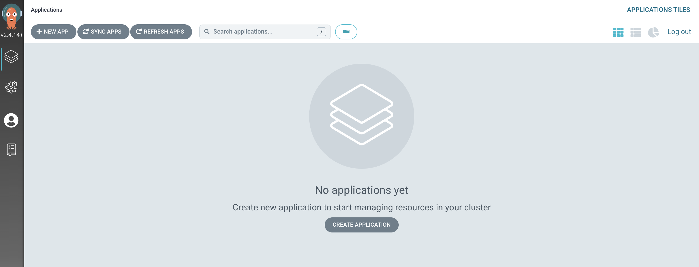

# Argo CD Getting Started

Argo CD is installed as a Kubernetes CRD with various controllers. One of these controllers continuously monitors the managed objects (usually stored as YAML or JSON) and compares the current state against the desired state (stored in a defined Git repo).

Deployed resources whose live state doesn't match the desired state is considered "out of sync". Argo CD will report and also visualizes the divergence, while providing methods to either automatically or manually reconcile the state.

For more in depth overview, you can see the [official documentation around architecture](https://argo-cd.readthedocs.io/en/stable/operator-manual/architecture/)

# Installation

In order to install Argo CD, you'll need the `kubectl` CLI installed and access to a Kubernetes cluster. If testing locallay, you can use one of the following:

* [MiniKube](https://minikube.sigs.k8s.io/docs/start/)
* [Kind](https://kind.sigs.k8s.io/)
* [OpenShift Local](https://developers.redhat.com/products/openshift-local/overview)

Once you have a cluster, you are ready to install Argo CD. You first need to create the `argocd` namespace.

```
kubectl create namespace argocd
```

Once created, you can apply the following YAML provided by the Argo Project's git repo.

```
kubectl apply -n argocd -f https://raw.githubusercontent.com/argoproj/argo-cd/stable/manifests/install.yaml
```

# Installing Argo CD CLI

Argo CD has a CLI utilty that is handy to have when wanting to do specific things like syncing, pausing, refreshing, and various other things not built into the standard `kubectl` cli tool. 

You can find the CLI in the releases page on the [Argo CD GitHub Repo](https://github.com/argoproj/argo-cd/releases)

> NOTE: The `argocd` cli can be installed via `brew` for Mac OS users: `brew install argocd`

Once downloaded, make sure you've put it in your `PATH`.

# Verifying Installation

Verify that Argo CD is installed by running `kubectl get pods -n argocd`

```
$ kubectl get pods -n argocd
NAME                                                READY   STATUS    RESTARTS   AGE
argocd-application-controller-0                     1/1     Running   0          12m
argocd-applicationset-controller-74558d8789-2fcql   1/1     Running   0          12m
argocd-dex-server-5bf8b66b55-vggd6                  1/1     Running   0          12m
argocd-notifications-controller-dc5d7dd6-g8hrh      1/1     Running   0          12m
argocd-redis-6fd7cbd95d-cj28p                       1/1     Running   0          12m
argocd-repo-server-7c57dc5975-9fzrl                 1/1     Running   0          12m
argocd-server-7c85877d9d-vj8h2                      1/1     Running   0          12m
```

Also verify that the `argocd` cli is installed correctly by running `argocd version --client`

> NOTE: Your version/arch may vary.

```
$ argocd version --client
argocd: v2.1.3+d855831
  BuildDate: 2021-09-29T21:53:32Z
  GitCommit: d855831540e51d8a90b1006d2eb9f49ab1b088af
  GitTreeState: clean
  GoVersion: go1.16.5
  Compiler: gc
  Platform: darwin/amd64
```

# Accessing Argo CD

In order to access Argo CD's API, you need to first need to port forward the service. This should be done in a separate terminal window so you can run commands from your current terminal window.

> NOTE: Ideally you'd have an Ingress controller for Argo CD. See the [official documentation](https://argo-cd.readthedocs.io/en/stable/operator-manual/ingress/) for more info.

```
kubectl port-forward svc/argocd-server -n argocd 8080:443
```

Argo CD comes with a built-in admin user and password. Export the initial admin password into a variable to use for later:

```
export argocd_password=$(kubectl -n argocd get secret argocd-initial-admin-secret -o jsonpath="{.data.password}" | base64 -d)
```

Login via the CLI

```
argocd login  --insecure --username=admin --password=${argocd_password} localhost:8080
```

Verify that you're connected with `argocd cluster list`

```
$ argocd  cluster list
SERVER                          NAME        VERSION  STATUS   MESSAGE
https://kubernetes.default.svc  in-cluster           Unknown  Cluster has no applications and is not being monitored.
```

You can also login via the Argo CD WebUI using `admin` as the username and the output of `echo ${argocd_password}` as the password. Visit http://localhost:8080

Once you log in, you should see the following screen.

