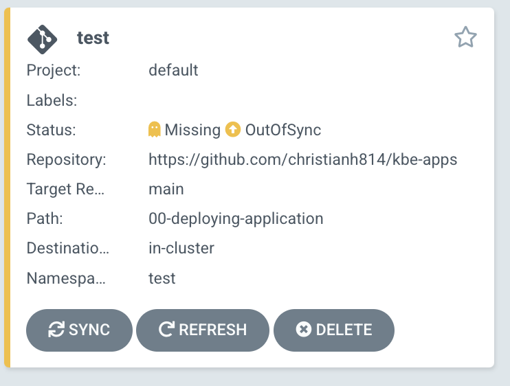
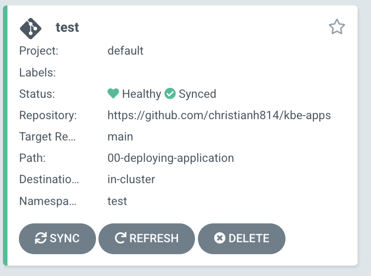
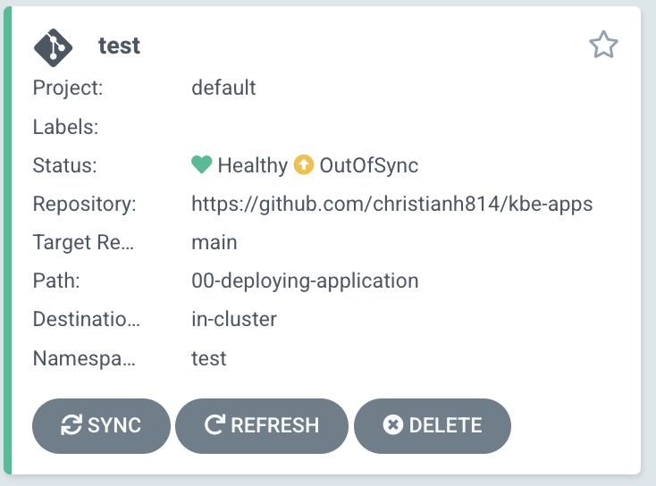

# Deploying an Application

Argo CD's primary job is to make sure that your desired state, stored in Git, matches your running state on your Kubernetes installation. It does this by comparing Kubernetes declarations (stored in YAML or JSON in Git) with the running state. Argo CD does this by treating a group of related manifests as an atomic unit. This atomic unit is called an Application, in Argo CD. An Argo CD Application is controlled by the Argo CD Application Controller via a Custom Resource. 

You can read more about Argo CD concepts by reading the [offical documentation](https://argo-cd.readthedocs.io/en/stable/core_concepts/).

# Application Repo

We will be working with this [example repo](https://github.com/christianh814/kbe-apps) throughout, but for this example, we will be working within the `00-deploying-application` directory. In this directory you will find:

* A [Namespace](https://github.com/christianh814/kbe-apps/blob/main/00-deploying-application/test-ns.yaml)
* A [Deployment](https://github.com/christianh814/kbe-apps/blob/main/00-deploying-application/test-deployment.yaml)
* A [Service](https://github.com/christianh814/kbe-apps/blob/main/00-deploying-application/test-svc.yaml)

We will be deploying these as a single unit with Argo CD using the Application CR (custom resource). We can do this via the Argo CD UI. First click on the `+ NEW APP` button on the Argo CD UI. And fill out the following.

* `Application Name`: test
* `Project Name`: default
* `SYNC POLICY`: Manual
* `RETRY` Select this off, and leave the defaults
* `Repository URL`: https://github.com/christianh814/kbe-apps
* `Revision`: main
* `Path`: 00-deploying-application
* `Cluster URL`: https://kubernetes.default.svc
* `Namespace`: test

> NOTE: You're probably thinking "What is https://kubernetes.default.svc?" That is Argo CD's way of identifying which cluster to apply the manifests to. In this case, it's the cluster Argo CD is running on. The address https://kubernetes.default.svc is the internal Kubernetes API endpoint.

Leave everything else as the default values and click `CREATE`.

You should see your Application as "Missing" and "OutOfSync"



Verify that your Application is not on your cluster by running `kubectl get all -n test`

```
$ kubectl get pods -n test
No resources found in test namespace.
```

You can also see the status with the `argocd` cli. Run `argocd app get test`

```
$ argocd app get test
Name:               test
Project:            default
Server:             https://kubernetes.default.svc
Namespace:          test
URL:                https://localhost:8080/applications/test
Repo:               https://github.com/christianh814/kbe-apps
Target:             main
Path:               00-deploying-application
SyncWindow:         Sync Allowed
Sync Policy:        <none>
Sync Status:        OutOfSync from main (a9ee236)
Health Status:      Missing

GROUP  KIND        NAMESPACE  NAME  STATUS     HEALTH   HOOK  MESSAGE
       Namespace              test  OutOfSync  Missing
       Service     test       bgd   OutOfSync  Missing
apps   Deployment  test       bgd   OutOfSync  Missing
```

Click on `SYNC` in the Argo CD UI, then `SYNCHRONIZE` to apply these manifests to your cluster. After a bit, you should see your Application as "Healthy" and "Synced"


 
 Your Application should now be running! Running `kubectl get all -n test` should now show your manifests applied to the cluster.

 ```
 $ kubectl get all -n test
NAME                       READY   STATUS    RESTARTS   AGE
pod/bgd-74dc875f9b-xzzrf   1/1     Running   0          118s

NAME          TYPE        CLUSTER-IP     EXTERNAL-IP   PORT(S)    AGE
service/bgd   ClusterIP   10.96.73.254   <none>        8080/TCP   118s

NAME                  READY   UP-TO-DATE   AVAILABLE   AGE
deployment.apps/bgd   1/1     1            1           118s

NAME                             DESIRED   CURRENT   READY   AGE
replicaset.apps/bgd-74dc875f9b   1         1         1       118s
```
# Divergence

Argo CD has the abilty to visualize any divergence in your cluster, as well the ability to reconcile that divergence. Let's introduce a change to the cluster. Change the scale of the `Deployment` from 1 to 3.

```
kubectl scale deployment/bgd --replicas=3 -n test
```

This should cause the Application to have the status of "OutOfSync".



This time, we can sync the Application with the `argocd` cli.

> NOTE: You could have also clicked "SYNC" in the Argo CD UI

```
argocd app sync test
```

# Self Heal

You can setup Argo CD to automatically correct drift by setting the `Application` manifest to do so. You can run `kubectl edit application test -n argocd` and set the following configuration:

Example:

```yaml
spec:
  syncPolicy:
    automated:
      prune: true
      selfHeal: true
```

Conversely, you can run the following command:

```
kubectl patch application/test -n argocd --type=merge -p='{"spec":{"syncPolicy":{"automated":{"prune":true,"selfHeal":true}}}}
```

Now try introducing a change by running the same scale command: `kubectl scale deployment/bgd --replicas=3 -n test`

What happend? Did you change apply?

Now that you have autoheal turned on, Argo CD will keep your cluster in sync with your desired state that's, in our case, currently store in GitHub!