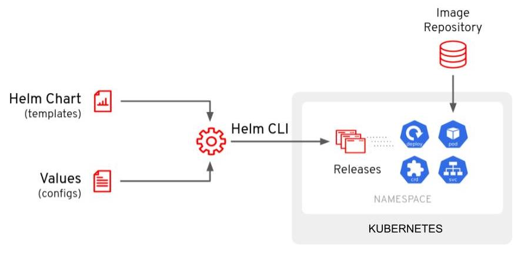
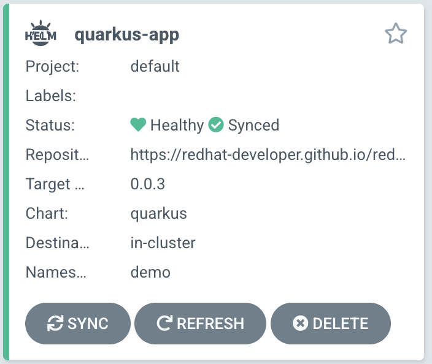
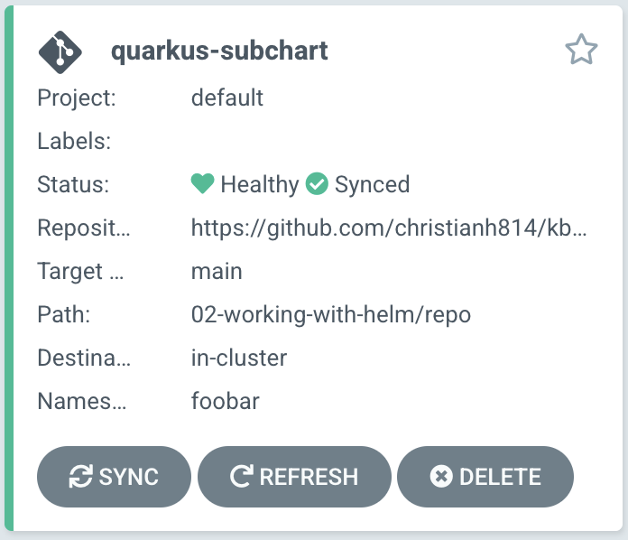

# Working With Helm

[Helm](https://helm.sh/) is considered the defacto package manager for Kubernetes applications. You can define, install, and update your pre-packaged applications or comsume a prebuilt packed application from a trusted repository. This is a way to bundle up, and deliver prebuilt Kubernetes applications.

The main components of Helm are:

* `Chart` - Which is a a package consisting of related Kubernetes YAML files used to deploy something (Application/Application Stack/etc).
* `Repository` - Is a place where Charts can be stored, shared and distributed.
* `Release` - Is a specific instance of a Chart deployed on a Kubernetes cluster.

Helm works by the user providing parameters (most of the time via a YAML file) against a Helm chart via the CLI. These parameters get injected into the Helm template YAML to produce a consumable YAML that us deployed to the Kubernetes cluster.



# Argo CD and Helm

Argo CD has native support for Helm built in. You can directly call a Helm chart repo and provide the values directly in the [Application](https://argoproj.github.io/argo-cd/operator-manual/declarative-setup/#applications) manifest. Also, you can interact and manage Helm on your cluster directly with the Argo CD UI or the `argocd` CLI.

There are two ways to deploy a Helm chart with Argo CD. The first is to use an Argo CD Application, and specify the parameters. We will be deploying [this application](https://raw.githubusercontent.com/christianh814/kbe-apps/main/02-working-with-helm/app/quarkus-app.yaml). Taking a look at `.spec.source.helm`, you'll see that you can provide the parameters directly in this manifest. Snippet:

```yaml
spec:
  source:
    helm:
      parameters:
        - name: build.enabled
          value: "false"
        - name: deploy.route.tls.enabled
          value: "true"
        - name: image.name
          value: quay.io/redhatworkshops/gitops-helm-quarkus
    chart: quarkus
    repoURL: https://redhat-developer.github.io/redhat-helm-charts
    targetRevision: 0.0.3
```

Let's break this `.spec.source.helm` section down a bit:

* `parameters` - This section is where you'll enter the parameters you want to pass to the Helm chart. These are the same values that you'd have in your `Values.yaml` file.
* `chart` - This is the name of the chart you want to deploy from the Helm Repository.
* `repoURL` - This is the URL of the Helm Repository.
* `targetRevision` - This is the version of the chart you want to deploy.

This can be used to deploy the Helm chart on to your cluster, which is like using `helm install ...`.

> **NOTE** What actually happens is that Argo CD runs `helm template ... | kubectl apply -f -`.

Deploy this manifest by running `kubectl apply`

```
kubectl apply -f \
https://raw.githubusercontent.com/christianh814/kbe-apps/main/02-working-with-helm/app/quarkus-app.yaml
```

Once you've applied this Argo CD Application manifest, it should deploy the specified Helm chart. Looking in the Argo CD WebUI, you should see the following:



Pay special attention to the Helm (⎈) logo, indicating that it's a Helm chart being deployed with Argo CD.

# Umbrella Charts

The [Helm Umbrella Chart](https://github.com/argoproj/argocd-example-apps/blob/master/helm-dependency/README.md), is sort of a "meta" (empty) Helm Chart that lists other Helm Charts as a dependency. To put it simply, it's an emtpy Helm chart in a repo that lists other Helm Charts to install.

> NOTE: In the next example there will only be one chart, but you can list multiple charts. This is helpful for when your Application is made up of several Helm Charts.

Taking a look at the example repo in the [02-working-with-helm/repo/](https://github.com/christianh814/kbe-apps/02-working-with-helm/repo) directory. You will see two files. A [Chart.yaml](https://raw.githubusercontent.com/christianh814/kbe-apps/main/02-working-with-helm/repo/Chart.yaml) file and a [Values.yaml](https://raw.githubusercontent.com/christianh814/kbe-apps/main/02-working-with-helm/repo/values.yaml) file. 

The `Chart.yaml` file, is creating an "empty" Helm chart and adding the Helm chart you want to deploy as a dependency in the `dependecies` secion.

```yaml
apiVersion: v2
name: quarkus-subchart
type: application
version: 1.0.0
appVersion: "1.0.0"
dependencies:
- name: quarkus
  version: 0.0.3
  repository: https://redhat-developer.github.io/redhat-helm-charts
```

The `values.yaml` file specifies the values you want to pass to the Helm chart.

```yaml
quarkus:
  build:
    enabled: false
  deploy:
    route:
      enabled: false
    replicas: 2
  image:
    name: quay.io/redhatworkshops/gitops-helm-quarkus
```

We will be deploying this Helm Chart with Argo CD using the WebUI. First click on the `+ NEW APP` button on the Argo CD UI. And fill out the following.

* `Application Name`: quarkus-subchart
* `Project Name`: default
* `SYNC POLICY`: Automatic
* `SELF HEAL`: Enable this
* `AUTO-CREATE NAMESPACE`: Enable this as well
* `RETRY` Enable this, and leave the defaults
* `Repository URL`: https://github.com/christianh814/kbe-apps
* `Revision`: main
* `Path`: 02-working-with-helm/repo
* `Cluster URL`: https://kubernetes.default.svc
* `Namespace`: foobar

After a while, you should see the Application synced and healthy. Note that this time, you will see this as a "Git" Application (denoted by the Git logo) instead of a Helm Application. 



Taking a step back with this method; This is more GitOps friendly as now the state of your deployment is stored in a git repo. You can now use git workflows to update this application if, for example, you want to change the image or the number of replicas. You can now PR into this repo as you would in a GitOps workflow.