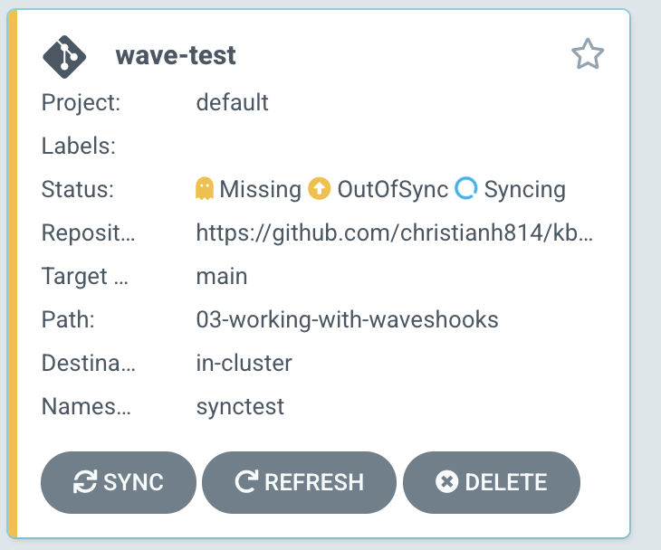
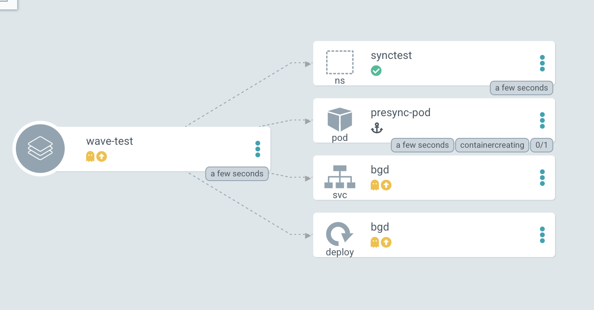
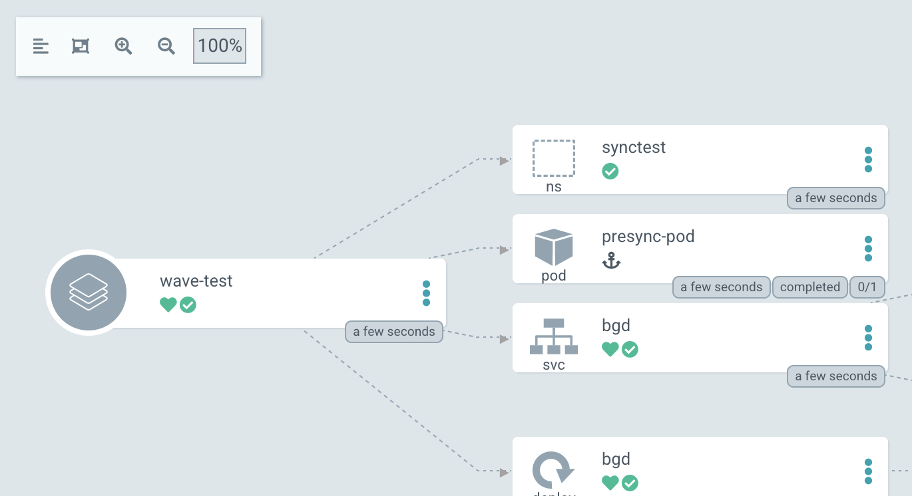

# Syncwaves and Hooks

[Syncwaves](https://argoproj.github.io/argo-cd/user-guide/sync-waves/) are used in Argo CD to order how manifests are applied to the cluster. Whereas [resource hooks](https://argoproj.github.io/argo-cd/user-guide/resource_hooks/) breaks up the delivery of these manifests in different phases.

All manifests have a wave of zero by default, but you can set these by using the `argocd.argoproj.io/sync-wave` annotation.
    
Example:

```yaml
metadata:
  annotations:
    argocd.argoproj.io/sync-wave: "2"
```

The wave can also be negative as well.

```yaml
metadata:
  annotations:
    argocd.argoproj.io/sync-wave: "-5"
```

When Argo CD starts a sync action, the manifest get placed in the following order:

* The Phase that they're in (we'll cover phases in a bit)
* The wave the resource is annotated in (starting from the lowest value to the highest)
* By kind (Namspaces first, then services, then deployments, etc ...)
* By name (ascending order)

Read more about syncwaves on the [official documentation site](https://argoproj.github.io/argo-cd/user-guide/sync-waves/#how-do-i-configure-waves)

Controlling your sync operation can be futher redefined by using hooks. These hooks can run before, during, and after a sync operation.

These hooks are:

* **PreSync** - Runs before the sync operation. This can be something like a database backup before a schema change
* **Sync** - Runs after `PreSync` has successfully ran. This will run alongside your normal manifesets.
* **PostSync** - Runs after `Sync` has ran successfully. This can be something like a Slack message or an email notification.
* **SyncFail** - Runs if the `Sync` operation as failed. This is also used to send notifications or do other evasive actions.

To enable a sync, annotate the specific object manfiest with `argocd.argoproj.io/hook` with the type of sync you want to use for that resource.

For example, if I wanted to use the `PreSync` hook:

```yaml
metadata:
  annotations:
    argocd.argoproj.io/hook: PreSync
```

You can also have the hooks be deleted after a successful/unsuccessful run.

* **HookSucceeded** - The resouce will be deleted after it has succeeded.
* **HookFailed** - The resource will be deleted if it has failed.
* **BeforeHookCreation** - The resource will be deleted before a new one is created (when a new sync is triggered).

You can apply these with the `argocd.argoproj.io/hook-delete-policy`
annotation. For example

```yaml
metadata:
  annotations:
    argocd.argoproj.io/hook: PostSync
    argocd.argoproj.io/hook-delete-policy: HookSucceeded
```

# Using Syncwaves and Hooks

In this example, we will be deploying the sample application in the [03-working-with-waveshooks](https://github.com/christianh814/kbe-apps/tree/main/03-working-with-waveshooks) directory in the sample repo. You'll notice that the there is various YAMLs for this application. Each manifest has been annotated with a wave. 

Argo CD, using the annotations, will deploy the manifests in the following order.

* [presync.yaml](https://raw.githubusercontent.com/christianh814/kbe-apps/main/03-working-with-waveshooks/presync.yaml) - This will go first because it is in the "PreSync" phase since it's annotated with `argocd.argoproj.io/hook: PreSync`
* [namespace.yaml](https://raw.githubusercontent.com/christianh814/kbe-apps/main/03-working-with-waveshooks/namespace.yaml) - The namespace will then go next because it's in the "Sync" phase (the default when no annotation is present), and it is in wave `0` as indicated with the annotation `argocd.argoproj.io/sync-wave: "0"`
* [deployment.yaml](https://raw.githubusercontent.com/christianh814/kbe-apps/main/03-working-with-waveshooks/deployment.yaml) - The deployment will come after the deployment because it's annotated with `argocd.argoproj.io/sync-wave: "1"`
* [service.yaml](https://raw.githubusercontent.com/christianh814/kbe-apps/main/03-working-with-waveshooks/service.yaml) - Finally, the service gets deployed as it's annotated with ` argocd.argoproj.io/sync-wave: "2"`

To see this in action, create the Application with the `argocd` cli:

```
argocd app create wave-test \
--repo https://github.com/christianh814/kbe-apps \
--path 03-working-with-waveshooks \
--dest-namespace synctest \
--dest-server https://kubernetes.default.svc \
--self-heal \
--sync-policy automated \
--sync-option CreateNamespace=true \
--sync-retry-limit 5 \
--revision main
```

This should create an Application that you can see in the Argo CD UI



When you click on this "card", it'll take you to the tree view and you can see the process taking place.



You will note that the manifests will deploy in the order specified by the annotations. After the phases and waves happen, the application should be fully synced.



# Why?

Ordering manifests comes in handy when you are deploying a workload that needs to have a certian order. For example, if you have a 3 tiered application with a frontend, backend, and database. In this scenario you might want the database to come up first, then the backend, and at the end the frontend.